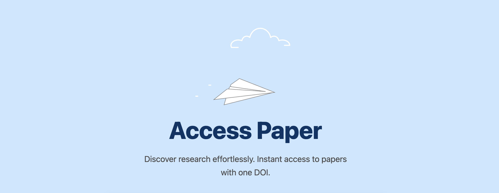
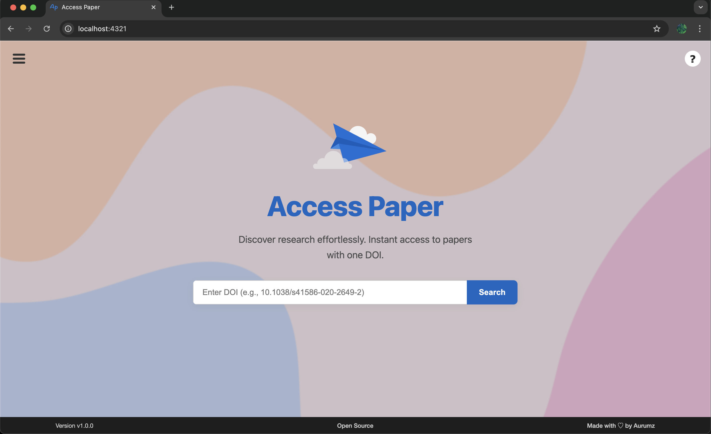
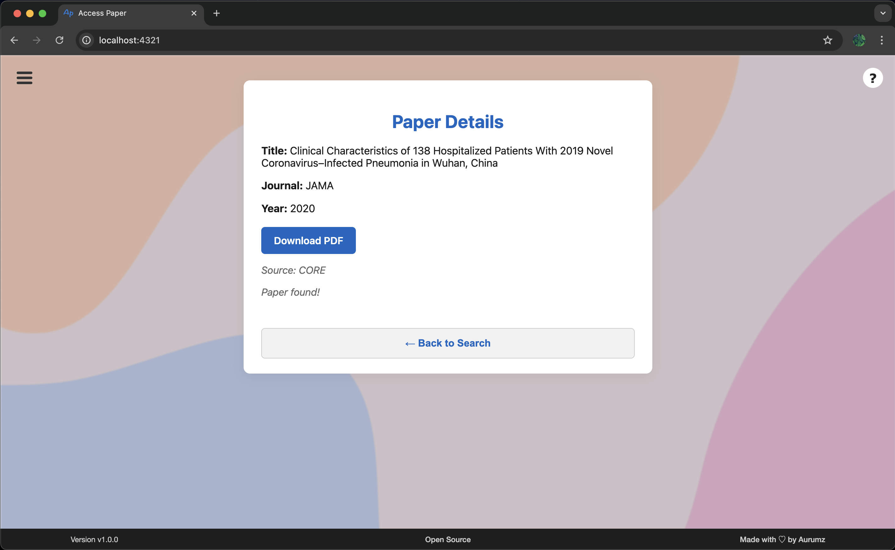

**AccessPaper** is a research tool that helps you quickly find and access legal copies of full-text research papers using their DOI, providing a simple and efficient way to retrieve full-text documents.

---

## 🚀 Key Features

- **DOI-based search:** Quickly locate and access research papers using their DOI.  
- **Full-text retrieval:** Easily get the complete documents you need without hunting across multiple sources.    
- **Simple interface:** Clean, intuitive design for seamless navigation and paper retrieval.  
- **Privacy-focused:** All searches and data remain private; no documents are stored or shared.  

---

## Supported Sources

### Preprint Servers
- arXiv
- bioRxiv
- medRxiv
- ChemRxiv
- F1000Research

### Open Access Repositories
- Unpaywall
- Europe PMC
- PubMed Central (PMC)
- Zenodo
- Figshare
- DOAJ
- OpenAIRE

### Publisher Sites
- PLOS
- Frontiers
- MDPI
- Hindawi
- Copernicus
- eLife
- Cell Press
- Springer
- Elsevier
- Wiley
- Nature
- Science
- IEEE
- ACM
- And many more...

### Metadata Sources
- Crossref
- OpenAlex
- Semantic Scholar
- PubMed
- Wikidata
- Google Books

---

## 📸 Screenshots

  
*Interface*

  
*Search Result.*

---

## Citation

If you use this software, please cite it using the following metadata:

> **Sahu, V. (2025). *Critiplot: A Python based Package for risk-of-bias data visualization in Systematic Reviews & Meta-Analysis* (v1.0.2). Zenodo. [https://doi.org/10.5281/zenodo.17338087](https://doi.org/10.5281/zenodo.17338087)**
(temporary citation dummy)

---

📄 License  
This project is licensed under the **Apache 2.0 License**.  

---

📬 Support
For questions, feedback, or collaboration ideas, reach out at **[pteroisvolitans12@gmail.com](mailto:pteroisvolitans12@gmail.com)** or open an issue on GitHub. Contributions are always welcome!  

